# Finding Lane Lines on the Road By *Mohamed Eltohamy*
----

#### The goal of this project is to identify lane lines on the road and draw them on the test images and videos. I'll be explaining how I managed to do that using the pipeline I created that employed techniques I learned in this course and others that I learned through the course of this project.

# Youtube Video of the Pipeline in action:

# Reflection
---

## 1. The Pipeline

#### The Pipeline consists of:
* [Color Selection](#color-selection)
* [Gray Scaling and Smooting](#gray-scaling-and-smoothing)
* [Canny Edge Detection](#canny-edge-detection)
* [Region of interest](#region-of-interest)
* [Hough Transform](#hough-transform)
* [Extrapolating Lane lines](#extrapolating-lane-lines)

Throughout the course of the project I will be showing the transformations on this set of test images:

I went ahead and borrowed *four* images form the challenge video to include it in the test images as seen in the last four images. I did that cause I wanted to test on images that have more noise like shade and different lighting.

## Color Selection
----
Here I applied multiple strategies to get the **white** and **yellow** lane lines from the test images.

### RGB filtering 

I first tried to use **RGB** filtering by applying a *white* and *yellow* masks on the image and here were the results: 

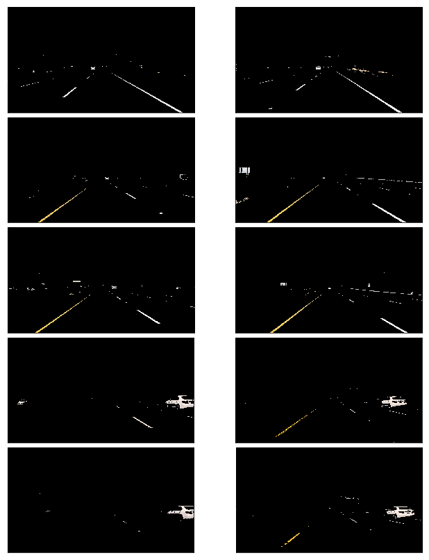

While this gives good results for some images it lacks to detect the lines for others like the images at the bottom which are mainly in the shade.

So instead of using the default **RGB** color space which didn't fit my data I went and explored two other color spaces:

* **HSV** which stands for Hue, Saturation, and Value 
* **HSL** which stands for Hue, Saturation, and Lightness

I used OpenCV's `cv2.cvtColor()` method to convert to each of the color spaces.

Here are the results for the **HSV** color space:
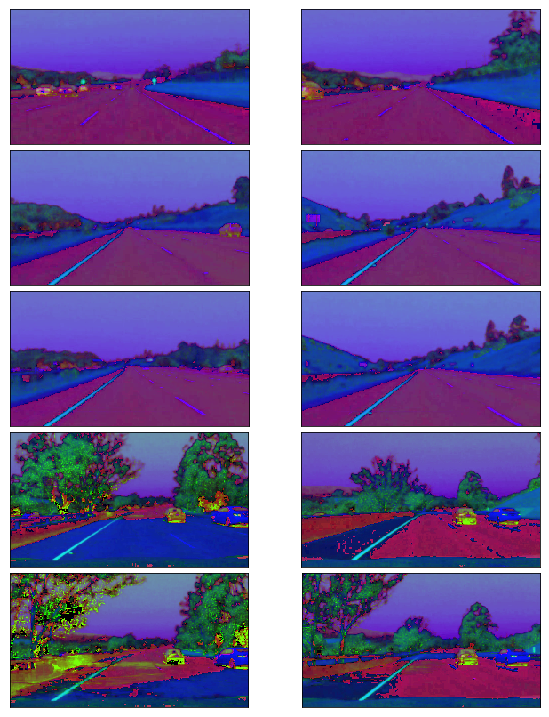

The **HSV** images clearly highlights the lane lines that are in the shaded area in the bottom 4 images something that our **RGB** filters lacked to accomplish;However, as you can see we lost all the lane lines in the top two images, the white lines aren't really visible especially the white dotted lines.

Then I checkout the **HSL** images:

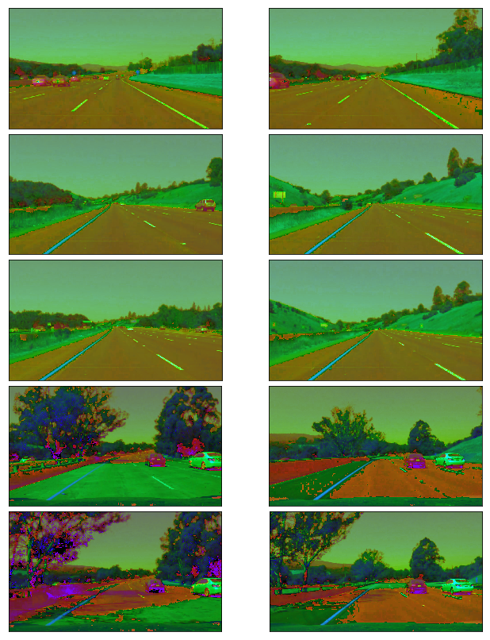

All lane lines are visible even the ones in the shade which is what was missing from the **RGB** images after filtering, so I ended up choosing the **HSL** images as the color space encompassed the best of both worlds.

Then I used a white/yellow mask to isolate the white and yellow colors in the image as show below:

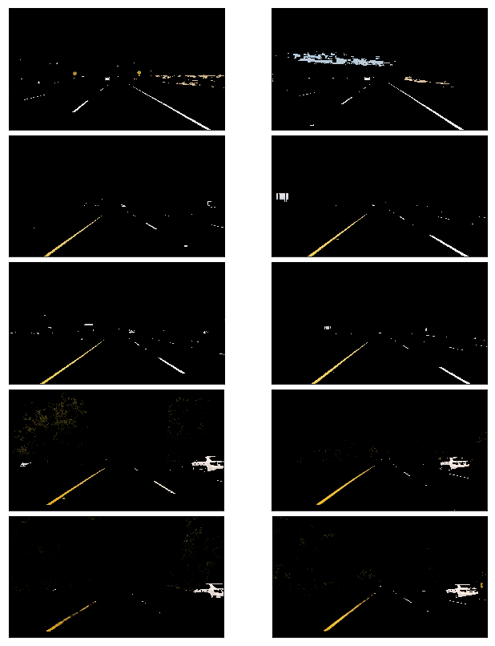

## Gray Scaling and Smoothing
---
After that I applies **grayscaling** on the images as shown here: 

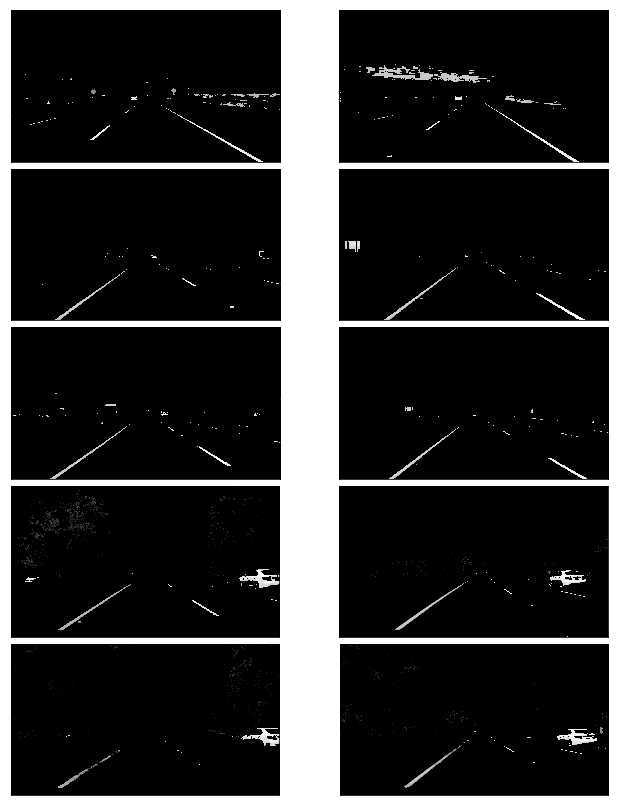

Then I applied smoothing the grayscaled image using **Gaussian Blur** before I applied **Canny edge detection**, I found that a filter size of 11 does a nice job on the sample images. Though **Canny Edge Detection** applies smoothing internally, we can't change the filter size so prior smoothing is recommended as a good practice.

Here are the results of the images after smoothing:

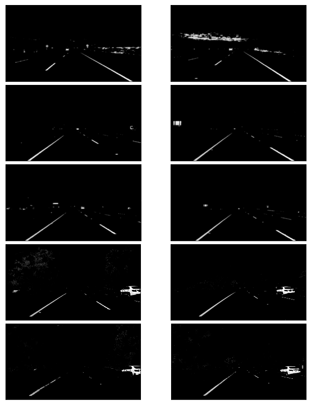

## Canny Edge Detection
---

Then I applied **Canny edge detection** with the thresholds of *50* to *150* which is *1:3 ratio* as recommended by **Canny**, and here are the results:

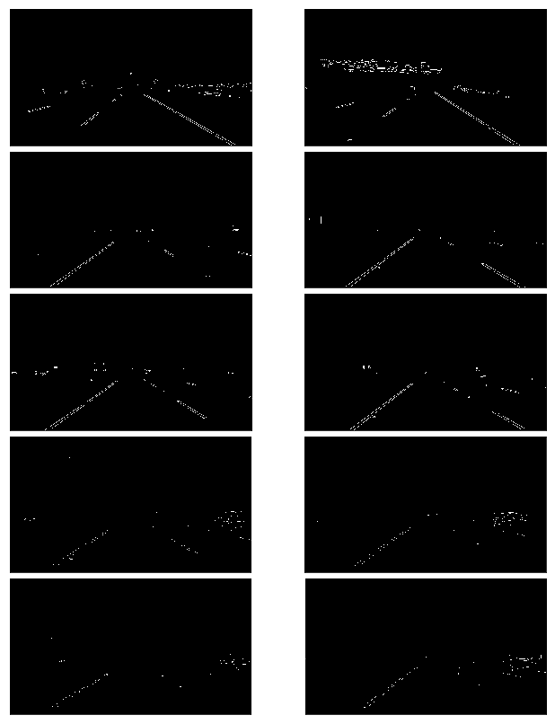

## Region of interest
---

After **selecting the colors, gray scaling, smoothing, and getting the image's Canny edges** I removed all the unimportant parts of the image like other lane lines, trees, sky, etc. to focus on the road ahead. I did this by applying a mask to only include pixels within a region of interest, and here is the results after applying it on the **Canny** images:

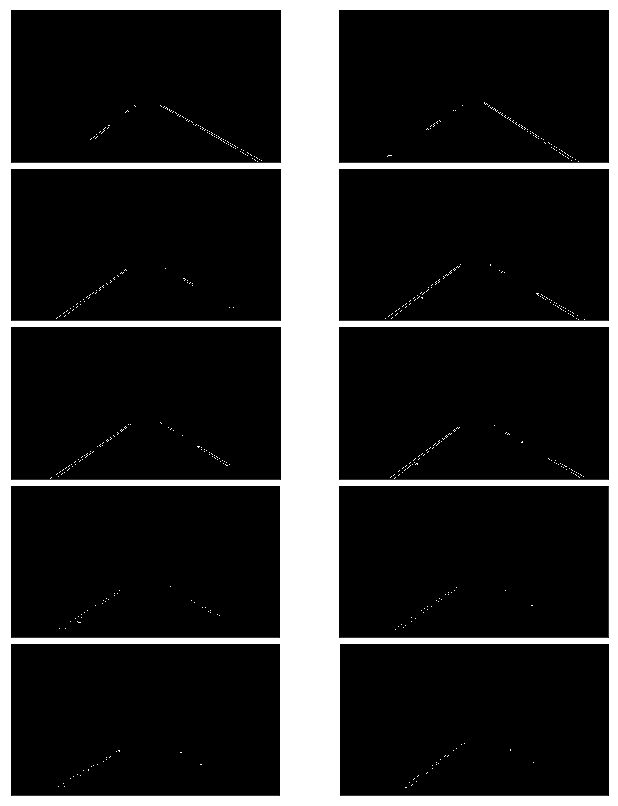

As you can see I got a good *outlines* of the lane lines, the region of interest is as follows:

- Bottom is set to the image bottom 
- Top is set to *60%* of the image hight(just below the image center) which I think is a good estimate for the horizon
- Its width spans the image with a little padding 5% to eachside and narrows towards the top of the image with a width of 10% 

This gives a good representation of a road with its lane lines narrowing toward the horizon. 

## Hough Transform
---
I then proceeded to apply the **Hough transform** which resulted in the lines below:

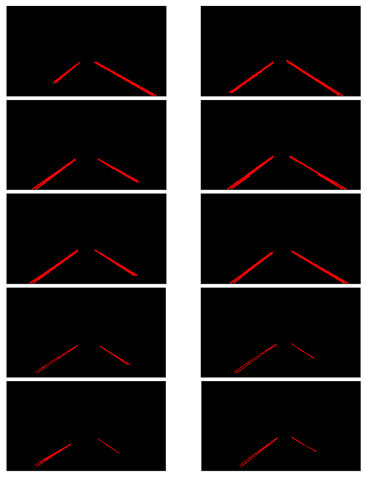

This result is pretty good for it show clear lines where the lane lines are, here are the lines drawn on top of the real images:

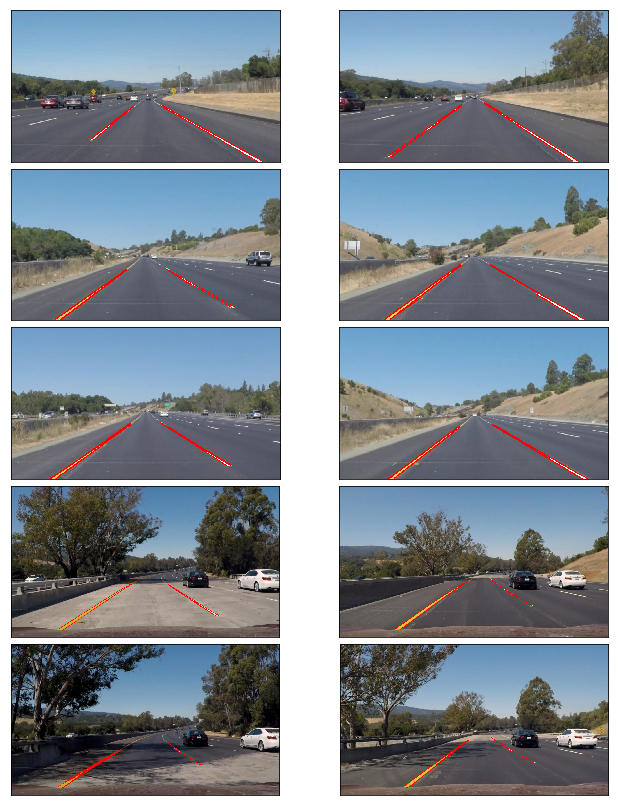

### So we're done, right? well not quite.

The lane lines are clearly identified and a red line is drawn over the line segments connecting most dashed lines segments; however, we can still see the gaps in some of images where the lines are not connected to the full extent of the lane lines. 

## Extrapolating Lane Lines
---
I altered the `hough_lines` to return a list of lines along with the image with lines drawn on them, I did this because these lines will be divided into right and left lane lines, averaged, and weighted to produce the best fit for the lane lines.

After finding the lane lines and drawing them I extrapolated (extended) the lane lines to have two continues lane lines from the bottom of the image (the car's body) and towards the horizon (60% of the image). I achieve this by:

* [Averaging LaneLines](#averaging-lanelines)
* [Making Lines to Draw](#making-lines-to-draw)
* [Drawing the Lane Lines](#drawing-the-lane-lines)

#### Averaging LaneLines

I wrote a method `average_slope_yintercept` that returns two lane lines (slope, y-intercept) by dividing our lane lines as left and right using their slopes *negative* slope means *left lane* and *positive* means *right lane* (inversed), then I averaged each lane line *slopes* and *y-intercepts* to get a single line for each lane. Also I used each *line length* as a *weight* to give more consideration to lines that are *longer* in length. 

#### Making Lines to Draw 

Then I made lines for the averaged lane lines from their **slopes** and **y-intercepts** using the 
straight line equation `y = mx + b`

#### Drawing the Lane Lines

I decided to make `draw_lane_lines()` method to handle drawing the extrapolated lane lines instead of altering `draw_lines()` method for better code organization, so basically `draw_lane_lines()` is my modified `draw_lines()`.

Here are the results of the `draw_lane_lines()` "darw_line()" method: 
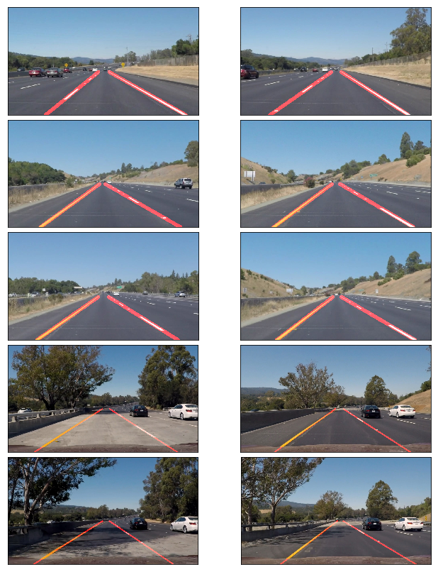

## One more thing (Averaging video frames)
---
### Done?
Actually still one more thing. After applying the pipeline on the first video **solidWhiteRight** the result seemed ok though the lines were a little jittery. 
However, when applying it to the second video **solidYellowLeft** i noticed that at a certain second in the video the lane lines crossed each other for as you can see here: 
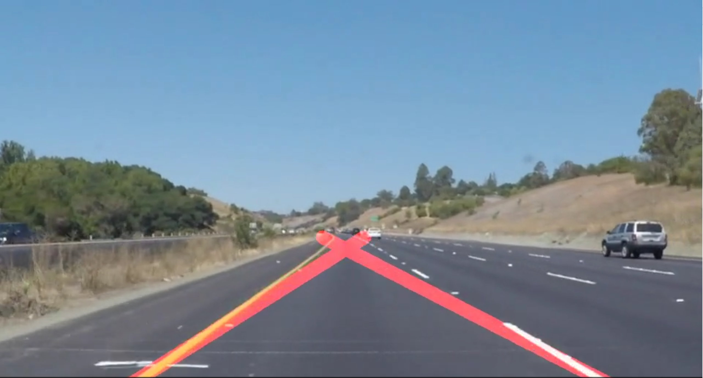

Since videos mainly play 60 frames per second and each frame is an image, therefore I averaged the frames' lines to have a smoother and more consistent lane lines that didn't jitter and cross each other due to a couple of faulty frames.
I chose to average across a **30** frame sample, this number gave me the most stable results.

So I made a `class` called `LaneLineFinder` with:
* `SAMPLE_FRAMES` as a *constant* number of frames to average across
* `right_lane_lines` and `left_lane_lines` are two `deque` (queue in python) variables of length `SAMPLE_FRAMES`  
* `average_line_sampling` gets the average of the previous `SAMPLE_FRAMES` frames using numpy `np.mean` method
* `process_image` which executes the pipeline

## Video links
---
You can checkout the full video processed videos in the links provided below: 

* [Solid white right](https://youtu.be/kV6LGD-cY3I)
* [Solid yellow left](https://youtu.be/iUBEwLEFOYI)
* [Challenge](https://youtu.be/MwuveIP4Lpc)

## 2. Potential shortcomings with the pipeline

Here are so shortcoming that I need to address in the coming weeks as I advance through the course:

1. Identifying curves and curving my extrapolated lines accordingly.
2. It also seems that the line quality is tested when the car is driving at higher speeds.
3. I need a more robust and dynamic way of identifying the road's horizon rather than just including 60% of the image hight.
4. I don't know what will be the case if there is a car close and in the same lane us our line of site, also what will be the case if the car is either white or yellow?
5. Will this algorithm work in low light situation?

## 3. Possible improvements could be

1. Identifying the horizon using a color filter as I did with the lane lines using the tarmac, or asphalt color.
2. Ignoring horizontal lines to make the pipeline immune to close cars in the same lane.
3. Using a different detection method that deals with higher order polynomial to account for curved lines
